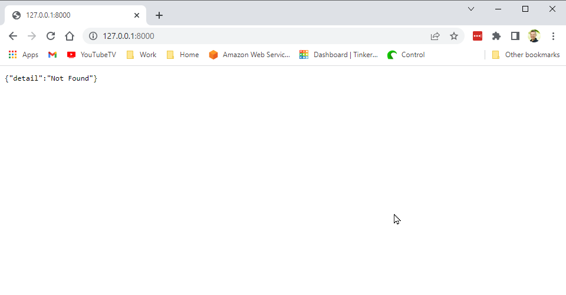
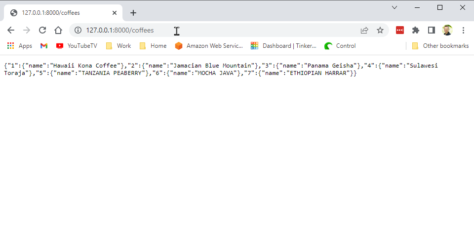
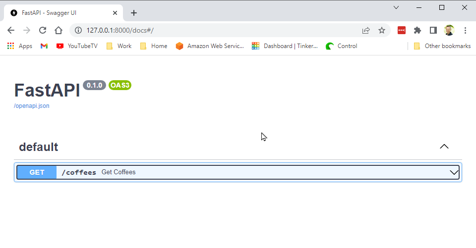
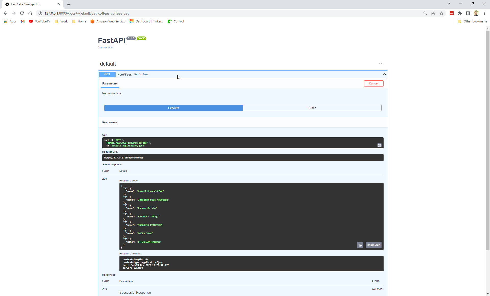
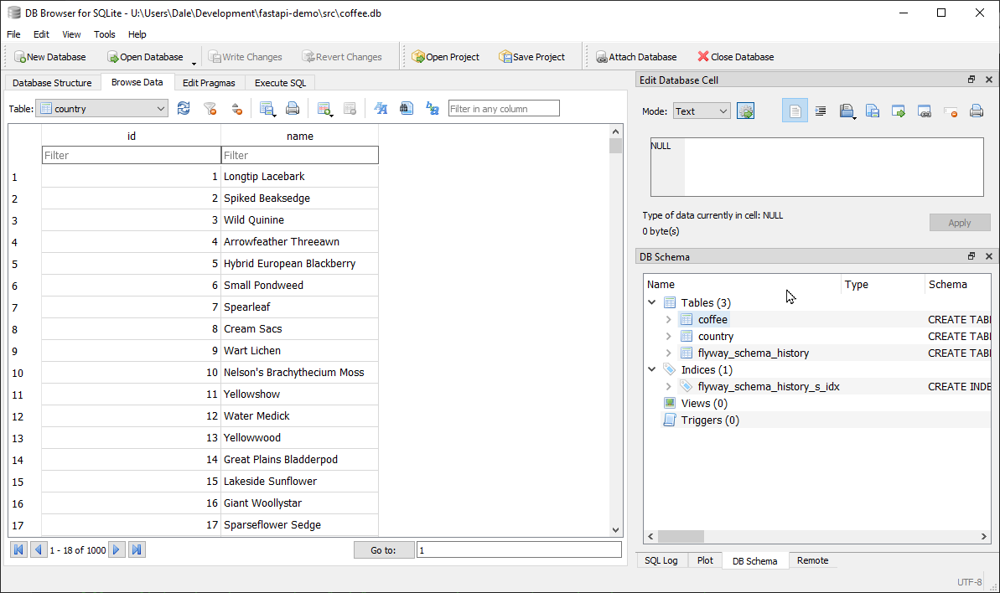
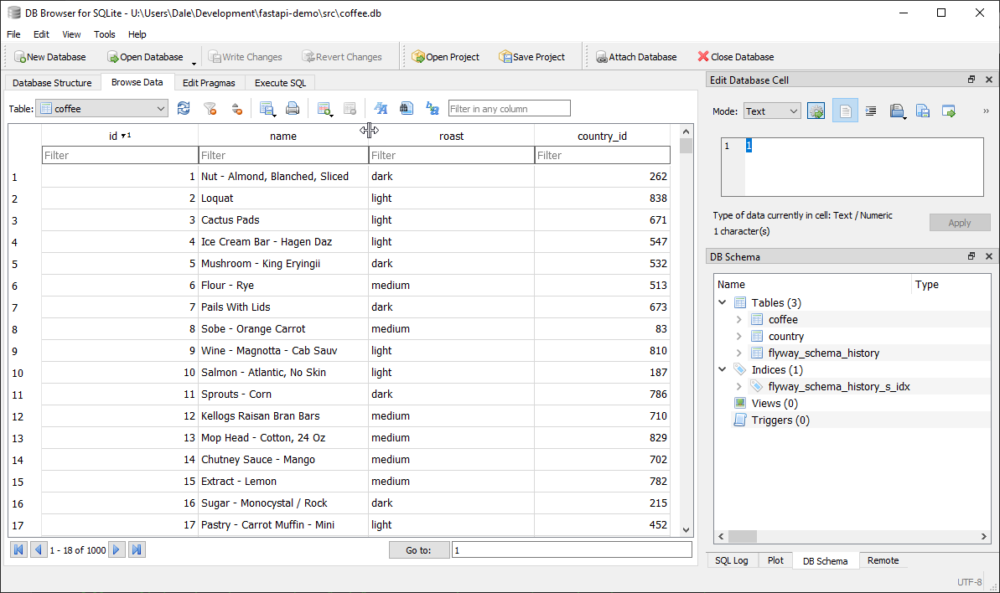
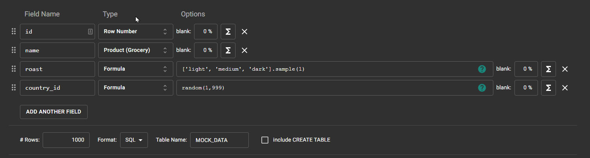

# fastapi-demo

## Table of contents

* [Prerequisites](#prerequisites)
* [Exercise 1](#exercise-1-steps)
* [Exercise 2](#exercise-2-steps)
* [Exercise 3](#exercise-3-steps)
* [Exercise 4](#exercise-4-steps)
* [Exercise 5](#exercise-5-steps)

## Prerequisites

### Setup Your Virtual Environment

There are many (too many) package managers for python and while we could explore some of the new ones, we're 
going to keep it simple by using the venv module to create the virtual environment and requirements.txt to
store the application dependencies.

First create your virtual environment.

```shell
$ python -m venv .venv
```

Now activate the environment.  Note some IDEs will do this for you.

```shell
$ source .venv/Scripts/activate
```

NOTE: If git commands or python is not found on your path you may also 
need to source your `.bash_profile` if you setup your system path here. 

```shell
$ source ~/.bash_profile
```

## Exercise 1 Steps

* Install Prerequisites
* Create a git repository on GitHub for `fastapi-demo`
* Clone the repository to your local machine and `cd` into your repository directory.
* Create a `dev` branch.
```shell
$ git checkout -b dev
```
### Install FastAPI Dependencies

Create a requirements.txt file in the root of the project.

requirements.txt
```
fastapi
uvicorn
```

Now install these requirements with the following command.
```shell
$ pip install -r requirements.txt
```


* Create an `src/` directory
* Create a file `app.py`.
* Add the following imports
```python 
from fastapi import FastAPI
import uvicorn

app = FastAPI()

if __name__ == "__main__":
    uvicorn.run("app:app", host="127.0.0.1", reload=True)
```
* Test your setup - from a terminal window run the following from the `/src` directory.

```shell
$ python app.py
```

You should see something like this.

```
$ python app.py
Will watch for changes in these directories: ['U:\\Users\\Dale\\Development\\fastapi-demo\\src']
Uvicorn running on http://127.0.0.1:8000 (Press CTRL+C to quit)    
Started reloader process using StatReload
Started server process
Waiting for application startup.
Application startup complete. 
```

## Exercise 2 Steps

Now we're going to create a new API fast.  I'm a coffee snob, so we're going to be building out a coffee API to fetch and save coffees.

* In the app.py create a coffee dictionary with the worlds best 7 coffee beans as follows.
```python
coffees = {
    1: { "name": "Hawaii Kona Coffee" },
    2: { "name": "Jamacian Blue Mountain" },
    3: { "name": "Panama Geisha" },
    4: { "name": "Sulawesi Toraja"},
    5: { "name": "TANZANIA PEABERRY" },
    6: { "name": "MOCHA JAVA" },
    7: { "name": "ETHIOPIAN HARRAR" },
}
```

* Now create an API to fetch this list of beans.

```python
@app.get("/coffees")
def get_coffees():
    return coffees
```

* Test your application

You can copy and paste the URL from the terminal window to access your server.

http://127.0.0.1:8000/

This will show a page not found because you don't have a route to `/`. 



Change the path the http://127.0.0.1:8000/coffees.  Viola your data!!



Uvicorn comes with a build in Swagger UI. Swagger is an API tester to verify your API is
working as designed for all of your consumers (i.e. the user interface)



When you `Try it Out` you will see the response in a nicely formatted JSON response.



## Exercise 3 Steps

Now we're going to layer in some CRUD (Create, Read, Update, and Delete Operations) to 
our coffee list.  We've previously coded a GET operation, but now we're going to add in
PUT, POST, and DELETE HTTP Methods.

Each of these will be interacting with the coffees dictionary.

* First lets add a new GET operation to get a single coffee resource.

Add the following imports to app.py
```python
from fastapi import FastAPI, Path, HTTPException, status
from typing import Optional
```

```python
@app.get("/coffees/{coffee_id}")
def get_by_id(coffee_id: int = Path(description="The ID of the bean you'd like to retrieve", gt=0)):
    if coffee_id not in coffees:
        raise HTTPException( status_code=status.HTTP_404_NOT_FOUND, detail="Bean ID does not exists")
    else:
        return coffees[coffee_id]
```

There's a lot going on here.

* We're now taking in a path parameter `coffee_id` on the URL
* We have a description that will show up in the Swagger tool.  Check it out with `Try it Out`
* If we don't find something, we raise an HTTPException and set a 404 status code. 

Now lets call write the CRUD operations

* Add the following import so that we can submit a JSON payload.

```python
from pydantic import BaseModel
```

* Add the following class to represent our Model.

```python
class Coffee(BaseModel):
    name: str
    roast: str = None  # light, medium, dark
```

pydantic will do all the magic of marshalling and unmarshalling the JSON string into
this object.

* Add the following routes to the `app.py`

```python
@app.post("/coffees")
def create_coffee(coffee: Coffee):
    item_id = len(coffees) + 1
    if item_id in coffees:
        raise HTTPException( status_code=status.HTTP_400_BAD_REQUEST, detail="Coffee ID already exists")
    else:
        coffees[item_id] = coffee
    return coffees[item_id]


@app.put("/coffees/{item_id}")
def update_coffee(item_id: int, coffee: Coffee):
    if item_id not in coffees:
        raise HTTPException( status_code=status.HTTP_404_NOT_FOUND, detail="Coffee ID does not exists")
    else:
        coffees[item_id] = coffee
    return coffees[item_id]


@app.delete("/coffees/{item_id}")
def delete_coffee(item_id: int):
    if item_id not in coffees:
        raise HTTPException( status_code=status.HTTP_404_NOT_FOUND, detail="Coffee ID does not exists")
    else:
        del coffees[item_id]
    return {}
```

## Exercise 4 Steps

Updating an array isn't much fun because we lose our data between server restarts.  We're now going to 
attach our API to a SQLite Database.  

## Prerequisites

### Install sqlalchemy

Add the following to your requirements.txt

```
sqlalchemy
```

Now install this new requirement.

```shell
$ pip install -r requirements.txt
```
This exercise takes a bit to configure so just follow along and you'll have a fully functional API connected to a database
with two tables that define the relationships between the to.

### database.py

* Created a new `database.py` file in the `src/` directory with the following contents.
```python
from sqlalchemy import create_engine
from sqlalchemy.ext.declarative import declarative_base
from sqlalchemy.orm import sessionmaker

SQLALCHEMY_DATABASE_URL = "sqlite:///./coffee.db"

engine = create_engine(
    SQLALCHEMY_DATABASE_URL, connect_args={"check_same_thread": False}
)
SessionLocal = sessionmaker(autocommit=False, autoflush=False, bind=engine)

Base = declarative_base()
```

Coffees are from Countries so we're going to need to define a few schema files that represent the Coffee and Country 
schemas

* Create a `schemas/` directory within the `src` directory and add the following two files.

### coffee.py

```python
from sqlalchemy import Boolean, Column, ForeignKey, Integer, String
from sqlalchemy.orm import relationship
from database import Base


class Coffee(Base):
    __tablename__ = "coffee"

    id = Column(Integer, primary_key=True, index=True)
    name = Column(String)
    roast = Column(String)
    country_id = Column(Integer, ForeignKey("country.id"))
    country = relationship("Country", back_populates="coffees")
```

### country.py

```python
from sqlalchemy import Boolean, Column, ForeignKey, Integer, String
from sqlalchemy.orm import relationship
from database import Base


class Country(Base):
    __tablename__ = "country"

    id = Column(Integer, primary_key=True, index=True)
    name = Column(String)
    coffees = relationship("Coffee", back_populates="country")
```

* Create a `models/` directory within the `src` directory and add the following two files.

### coffee.py

```python
from pydantic import BaseModel


class CoffeeCreate(BaseModel):
    name: str
    roast: str = None  # light, medium, dark
    country_id: int


class Coffee(CoffeeCreate):
    id: int

    class Config:
        from_attributes = True
```

### country.py

```python
from pydantic import BaseModel


class CountryCreate(BaseModel):
    name: str


class Country(CountryCreate):
    id: int

    class Config:
        from_attributes = True
```

* We want to keep our database operations more in an isolated class and not in the main app.py file.  This is for ease 
of debugging and maintenance.  Create a `controller/` directory in the `src/` directory and add the following file. We
have basically moved all the CRUD operations from the app.py into a file that only has a dependency to the database.

### database_controller.py

```python
from sqlalchemy.orm import Session
from fastapi import FastAPI, Path, HTTPException, status
from typing import Optional

from models.coffee import Coffee as CoffeeModel
from models.coffee import CoffeeCreate as CoffeeCreateModel
from models.country import Country as CountryModel
from models.country import CountryCreate as CountryCreateModel
from schemas.coffee import Coffee as CoffeeSchema
from schemas.country import Country as CountrySchema
from typing import Dict


class DatabaseController:

    def get_coffees(self, db: Session):
        return db.query(CoffeeSchema).all()

    def get_coffee_by_name(self, name: str, db: Session):
        return db.query(CoffeeSchema).filter(CoffeeSchema.name == name).first()

    def get_coffee_by_id(self, item_id: int, db: Session):
        return db.query(CoffeeSchema).filter(CoffeeSchema.id == item_id).first()

    def create_coffee(self, coffee: CoffeeCreateModel, db: Session):
        response = None
        # Check to see if it already exists
        item = db.query(CoffeeSchema).filter(CoffeeSchema.name == coffee.name).first()

        if item is None:
            db_coffee = CoffeeSchema(name=coffee.name, roast=coffee.roast,
                                     country_id=coffee.country_id)
            db.add(db_coffee)
            db.commit()
            db.refresh(db_coffee)
            response = self.get_coffee_by_id(db_coffee.id, db=db)

        return response

    def update_coffee(self, coffee: CoffeeModel, db: Session):
        response = None
        db_coffee = db.query(CoffeeSchema).filter(CoffeeSchema.id == coffee.id).first()
        if db_coffee is not None:
            db_coffee.name = coffee.name
            db_coffee.roast = coffee.roast
            db_coffee.country_id = coffee.country_id
            db.commit()
            response = self.get_coffee_by_id(db_coffee.id, db=db)

        return response

    def delete_coffee(self, coffee_id: int, db: Session):
        coffee = db.query(CoffeeSchema).filter(CoffeeSchema.id == coffee_id).first()
        if coffee is not None:
            db.delete(coffee)
            db.commit()
        else:
            raise Exception( "Coffee does not exists to delete")
        return {}

    def get_countries(self, db: Session):
        return db.query(CountrySchema).all()

    def get_beans_for_country(self, country_id: int, db: Session):
        country = db.query(CountrySchema).filter(CountrySchema.id == country_id).first()
        return country.coffees

    def get_country_by_id(self, country_id: int, db: Session):
        return db.query(CountrySchema).filter(CountrySchema.id == country_id).first()

    def create_country(self, country: CountryCreateModel, db: Session):
        db_country = CountrySchema(name=country.name)
        db.add(db_country)
        db.commit()
        db.refresh(db_country)
        return self.get_country_by_id(db_country.id, db)

    def update_country(self, country: CountryModel, db: Session):
        response = None
        db_country = db.query(CountrySchema).filter(CountrySchema.id == country.id).first()
        if db_country is not None:
            db_country.name = country.name
            db.commit()
            response = self.get_country_by_id(db_country.id, db)

        return response

    def delete_country(self, country_id: int, db: Session):
        response = {}
        country = db.query(CountrySchema).filter(CountrySchema.id == country_id).first()
        if country is not None:
            db.delete(country)
            db.commit()
        else:
            response = None
        return response
```

* Now refactor the `app.py` to establish the database connection and call the `database_controller` depending on the 
route.

```python
from fastapi import FastAPI, Path, HTTPException, status, Depends
import uvicorn
from typing import Optional

from models.coffee import Coffee as CoffeeModel
from models.coffee import CoffeeCreate as CoffeeCreateModel

from models.country import Country as CountryModel
from models.country import CountryCreate as CountryCreateModel

from database import engine, SessionLocal, Base
from sqlalchemy.orm import Session
from controller.database_controller import DatabaseController
from typing import Dict

app = FastAPI()
controller = DatabaseController()

Base.metadata.create_all(bind=engine)


def get_db():
    try:
        db = SessionLocal()
        yield db
    finally:
        db.close()


@app.get("/coffees")
def get_coffees(db: Session = Depends(get_db)):
    return controller.get_coffees(db)


@app.get("/coffees/coffee")
def get_coffee_by_name(name: Optional[str] = None, db: Session = Depends(get_db)):
    # /coffees/coffee?name=sumatra
    coffee = controller.get_coffee_by_name(name, db)
    if coffee is not None:
        return coffee
    else:
        raise HTTPException(status_code=status.HTTP_404_NOT_FOUND, detail="Coffee does not exists")


@app.get("/coffees/{item_id}")
def get_coffee_by_id(item_id: int = Path(description="The ID of the bean you'd like to retrieve", gt=0)
                     , db: Session = Depends(get_db)):
    coffee = controller.get_coffee_by_id(item_id, db)
    if coffee is None:
        raise HTTPException(status_code=status.HTTP_404_NOT_FOUND, detail="Coffee does not exists")

    return coffee


@app.post("/coffees/coffee")
def create_coffee(coffee: CoffeeCreateModel, db: Session = Depends(get_db)):
    coffee = controller.create_coffee(coffee, db)

    if coffee is None:
        raise HTTPException(status_code=status.HTTP_400_BAD_REQUEST, detail="Coffee already exists")

    return coffee


@app.put("/coffees/coffee")
def update_coffee(coffee: CoffeeModel, db: Session = Depends(get_db)):
    coffee = controller.update_coffee(coffee, db)

    if coffee is None:
        raise HTTPException(status_code=status.HTTP_404_NOT_FOUND, detail="Coffee does not exists")
    return coffee


@app.delete("/coffees/{item_id}")
def delete_coffee(coffee_id: int, db: Session = Depends(get_db)):
    try:
        controller.delete_coffee(coffee_id, db)
    except Exception:
        raise HTTPException(status_code=status.HTTP_404_NOT_FOUND, detail="Coffee does not exists")

    return {}


@app.get("/countries")
def get_countries(db: Session = Depends(get_db)):
    return controller.get_countries(db)


@app.get("/countries/{country_id}/coffees")
def get_coffees_for_country(country_id: int, db: Session = Depends(get_db)):
    country = controller.get_country_by_id(country_id, db)
    return country.coffees


@app.get("/countries/{country_id}")
def get_country_by_id(country_id: int = Path(description="The ID of the Country you'd like to retrieve", gt=0)
                      , db: Session = Depends(get_db)):
    country = controller.get_country_by_id(country_id, db)

    if country is None:
        raise HTTPException(status_code=status.HTTP_404_NOT_FOUND, detail="Country does not exists")
    return country

@app.post("/countries/country")
def create_country(country: CountryCreateModel, db: Session = Depends(get_db)):
    country = controller.create_country(country, db)

    if country is None:
        raise HTTPException(status_code=status.HTTP_400_BAD_REQUEST, detail="Country already exists")

    return country


@app.put("/countries/country")
def update_country(country: CountryModel, db: Session = Depends(get_db)):
    country = controller.update_country(country, db)

    if country is None:
        raise HTTPException(status_code=status.HTTP_404_NOT_FOUND, detail="Country does not exists")
    return country


@app.delete("/countries/{country_id}")
def delete_country(country_id: int = Path(description="The ID of the Country you'd like to delete", gt=0)
                   , db: Session = Depends(get_db)):
    country = controller.delete_country(country_id, db)
    if country is None:
        raise HTTPException(status_code=status.HTTP_404_NOT_FOUND, detail="Country does not exists")
    return country


if __name__ == "__main__":
    uvicorn.run("app:app", host="127.0.0.1", reload=True)
```

## Exercise 5 Steps

There will be times when you need some supporting tools the help you with your application
development.  Two tools that will help you with your database are:
* [Flyway](https://documentation.red-gate.com/fd) -  Allows you to easily create a schema and seed it with lots of test data
* [DB Browser for SQLite](https://sqlitebrowser.org/) - Provides a UI to explore the tables in your database.

[Flyway](https://documentation.red-gate.com/fd) is an industry leading database versioning framework that aims to unlock DevOps for the database. It strongly favors simplicity and convention over configuration.

For this demo to run, you should run all commands through a **MS DOS Command Window** or **Windows Powershell**
Previously we had setup Flyway for MySQL in class.  That tutorial is [here](https://github.com/dghighfill/flyway-demo).
The only difference here is just the configuration and schema has changed for our Coffee application to support
SQLite.

This exercise will setup Flyway to connect to your pre-existing database and use DB Browser 
to explore the data.  Flyway will create the database from scratch for you as well.

Flyway is nothing more than a zip file that you can download and unzip to your local filesystem.

* Create a `flyway/` directory at the root of your project and add the following command file.
Set the FLYWAY_HOME to where you installed flyway

### run_flyway.cmd 
```
@REM Run this file from a Windows Command Prompt or Powershell window.
ECHO OFF
set FLYWAY_HOME=C:\<SOME_PATH>\Flyway\flyway-9.4.0

@REM This command will allow paramters to be passed such as info or migrate
%FLYWAY_HOME%/flyway.cmd -configFiles="./conf/flyway.toml" %1 %2 %3 %4
```

* Create `conf/` directory in the `flyway/` directory and add the `flyway.toml` file below.

```
[environments.default]
url = "jdbc:sqlite:../src/coffee.db"
user = "flyway"
password = "password"

[flyway]
environment = "default"
locations=["filesystem:sql"]
cleanDisabled = false
```

* Create an `sql/` directory in the `flyway/` directory.  This will contain your flyway
migration scripts.  Create the following files.

NOTE: that filenames have two underscores after the version.

### V1.1.0__create_schema.sql
```roomsql
CREATE TABLE IF NOT EXISTS country(
    id INTEGER NOT NULL PRIMARY KEY,
    name VARCHAR(25) NOT NULL
);

CREATE TABLE IF NOT EXISTS coffee(
    id INTEGER NOT NULL PRIMARY KEY,
    name VARCHAR(25) NOT NULL,
    roast VARCHAR(10),
    country_id INTEGER,
    FOREIGN KEY (country_id) REFERENCES country(id)
);
```

### V1.1.1__insert_data.sql

```roomsql
insert into country (id, name) values (1, 'Ethiopia');
insert into country (id, name) values (2, 'Italy');
```

* Create/Update the database by running the following command from the `flyway/` directory
from a Windows Command Prompt.

```shell
run_flyway.cmd info
```

Displays the following output

```
Flyway Community Edition 9.4.0 by Redgate

Database: jdbc:sqlite:../src/coffee.db (SQLite 3.34)
Schema version: << Empty Schema >>

+-----------+---------+------------------+------+--------------+---------+
| Category  | Version | Description      | Type | Installed On | State   |
+-----------+---------+------------------+------+--------------+---------+
| Versioned | 1.1     | create schema    | SQL  |              | Pending |
| Versioned | 1.1.1   | insert countries | SQL  |              | Pending |
+-----------+---------+------------------+------+--------------+---------+
``` 

Now if you run `migrate`, it will create the main schema, tables, and insert the data.
```
run_flyway.cmd migrate
```

You will get the following output
```
U:\Users\Dale\Development\fastapi-demo\flyway>run_flyway.cmd migrate

Flyway Community Edition 9.4.0 by Redgate

Database: jdbc:sqlite:../src/coffee.db (SQLite 3.34)
Successfully validated 3 migrations (execution time 00:00.030s)
Creating Schema History table "main"."flyway_schema_history" ...
Current version of schema "main": << Empty Schema >>
Migrating schema "main" to version "1.1 - create schema"
Migrating schema "main" to version "1.1.1 - insert countries"
Migrating schema "main" to version "1.1.2 - insert coffee"
Successfully applied 3 migrations to schema "main", now at version v1.1.2 (execution time 00:00.689s)
```

If you ever need to start over you can run to delete all rows on the database. 

```
run_flyway.cmd clean
```

### DB Browser

You can download [DB Browser for SQLite](https://sqlitebrowser.org/) and view the database
The screenshots below shows the data after our `flyway migrate`.

#### Countries



#### Coffees 



### Mockaroo

If you'd really like to seed your database with a lot of Test Data, you can use [Mockaroo](https://www.mockaroo.com/)
to add up to 1000 rows with the free version.  Map the Field names to your Schema and then
pick the format of SQL.  This will save you a lot of time creating volumes of data for your 
application.



## References
* [FastAPI Documentation](https://fastapi.tiangolo.com/)
* [FastAPI Tutorial](https://www.youtube.com/watch?v=-ykeT6kk4bk)
* [SQLLite](https://fastapi.tiangolo.com/tutorial/sql-databases/)
* [DB Browser for SQLite](https://sqlitebrowser.org/)
* [Flyway](https://documentation.red-gate.com/fd)
* [Mockaroo](https://www.mockaroo.com/)
